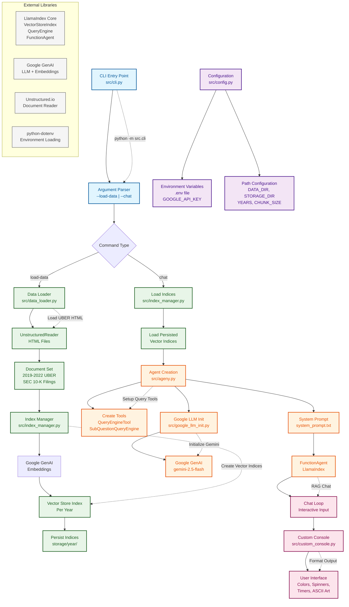

```mermaid
graph TB
    %% Entry Point
    CLI["CLI Entry Point<br/>src/cli.py"] --> ARG["Argument Parser<br/>--load-data | --chat"]

    %% Configuration Layer
    CONFIG["Configuration<br/>src/config.py"] --> ENV["Environment Variables<br/>.env file<br/>GOOGLE_API_KEY"]
    CONFIG --> PATHS["Path Configuration<br/>DATA_DIR, STORAGE_DIR<br/>YEARS, CHUNK_SIZE"]

    %% Data Flow
    ARG --> LOAD{Command Type}

    %% Load Data Path
    LOAD -->|"load-data"| DL["Data Loader<br/>src/data_loader.py"]
    DL --> UREAD["UnstructuredReader<br/>HTML Files"]
    UREAD --> DOCS["Document Set<br/>2019-2022 UBER<br/>SEC 10-K Filings"]
    DOCS --> IM["Index Manager<br/>src/index_manager.py"]
    IM --> EMB["Google GenAI<br/>Embeddings"]
    EMB --> VSI["Vector Store Index<br/>Per Year"]
    VSI --> PERSIST["Persist Indices<br/>storage/year/"]

    %% Chat Path
    LOAD -->|"chat"| LIM["Load Indices<br/>src/index_manager.py"]
    LIM --> LIND["Load Persisted<br/>Vector Indices"]

    %% Agent Creation
    LIND --> AGENT["Agent Creation<br/>src/ageny.py"]
    AGENT --> TOOLS["Create Tools<br/>QueryEngineTool<br/>SubQuestionQueryEngine"]

    %% LLM Integration
    AGENT --> GLLM["Google LLM Init<br/>src/google_llm_init.py"]
    GLLM --> GEMINI["Google GenAI<br/>gemini-2.5-flash"]

    %% System Components
    AGENT --> SP["System Prompt<br/>system_prompt.txt"]
    SP --> FUNC_AGENT["FunctionAgent<br/>LlamaIndex"]

    %% Chat Interface
    FUNC_AGENT --> CHAT["Chat Loop<br/>Interactive Input"]
    CHAT --> CONSOLE["Custom Console<br/>src/custom_console.py"]
    CONSOLE --> UI["User Interface<br/>Colors, Spinners,<br/>Timers, ASCII Art"]

    %% External Dependencies
    subgraph "External Libraries"
        LLAMA["LlamaIndex Core<br/>VectorStoreIndex<br/>QueryEngine<br/>FunctionAgent"]
        GAI["Google GenAI<br/>LLM + Embeddings"]
        UNST["Unstructured.io<br/>Document Reader"]
        DOTENV["python-dotenv<br/>Environment Loading"]
    end

    %% Styling
    classDef entry fill:#e1f5fe,stroke:#01579b,stroke-width:2px,color:#01579b
    classDef config fill:#f3e5f5,stroke:#4a148c,stroke-width:2px,color:#4a148c
    classDef data fill:#e8f5e8,stroke:#1b5e20,stroke-width:2px,color:#1b5e20
    classDef ai fill:#fff3e0,stroke:#e65100,stroke-width:2px,color:#e65100
    classDef ui fill:#fce4ec,stroke:#880e4f,stroke-width:2px,color:#880e4f
    classDef external fill:#f5f5f5,stroke:#424242,stroke-width:1px,color:#424242

    class CLI,ARG entry
    class CONFIG,ENV,PATHS config
    class DL,UREAD,DOCS,IM,VSI,PERSIST,LIM,LIND data
    class AGENT,TOOLS,FUNC_AGENT,GLLM,GEMINI,SP ai
    class CHAT,CONSOLE,UI ui
    class LLAMA,GAI,UNST,DOTENV external

    %% Flow Labels
    CLI -.->|"python -m src.cli"| ARG
    DL -.->|"Load UBER HTML"| UREAD
    IM -.->|"Create Vector Indices"| VSI
    AGENT -.->|"Setup Query Tools"| TOOLS
    GLLM -.->|"Initialize Gemini"| GEMINI
    FUNC_AGENT -.->|"RAG Chat"| CHAT
    CONSOLE -.->|"Format Output"| UI
```